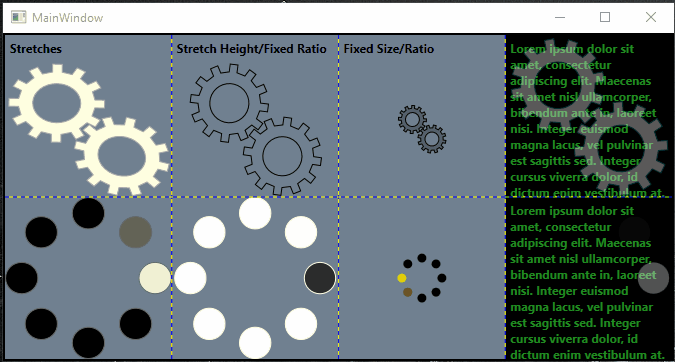

# Scalable Spinner Controls for WPF

This project contains (or will contain) vector-based busy indicators for 
XAML/WPF that scale to any needed size.  When looking for
"spinners" to show when the application was busy I could only 
find controls online that assumed a fixed size, say 20-40 pixels.

But often I wanted an indicator to stretch to the parent or container or
simply wanted to set to size to some arbitrary number.  Using something
raster-based is not a good choice due to pixelation.  So I developed this
project to server as a collection.

The original spinner paths were created in CAD as DWG and then converted to Adobe
Illustrator AI files after exporting to DXF.  The paths created in the AI were 
copy/pasted over to XAML via a text editor so Illustrator is not needed.  The 
following resources can be used for anyone interested in editing or creating
their own:

* <a href="http://freecadweb.org/" target="_blank">FreeCAD Open Source Project</a>
* <a href="http://babacad.com/" target="_blank">BabaCAD Free CAD Software</a>
* <a href="https://convertio.co/dxf-ai/" target="_blank">Convert DXF to AI file</a>
* <a href="http://www.dxfconverter.org/" target="_blank">Convert DXF to SVG file (and others)</a>

Screenshot of examples running in WPF:

